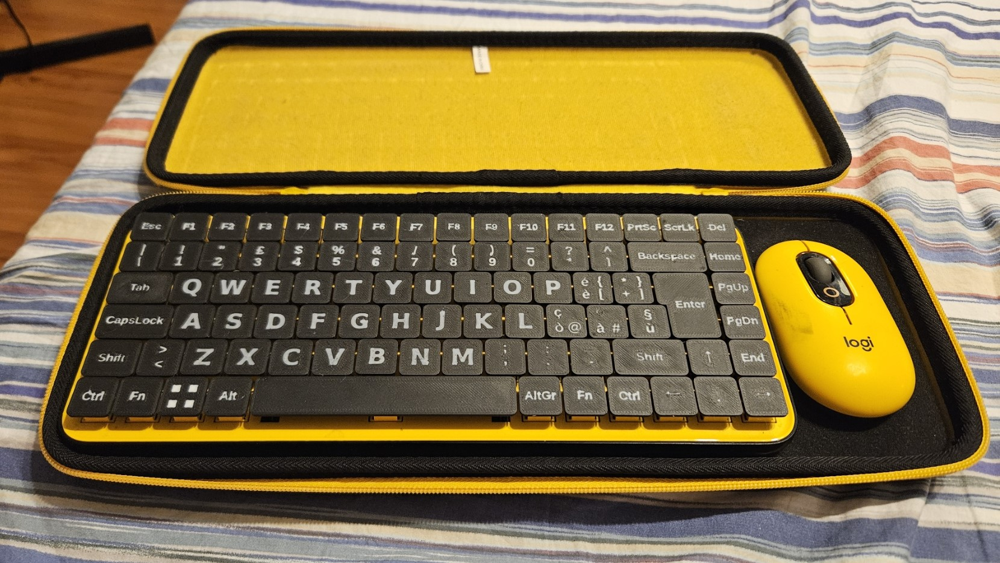

# Keycap 3mf generator

Generate custom low-profile keycaps using openscad that can be imported in slicers for 3d printing.

## Requirements:
* Openscad
* [BOSL2 library](https://github.com/BelfrySCAD/BOSL2)
* Python 3.10

## Generate a key:

- Enter key: `bash generate_model_kb.sh --letter 'text_Enter' --fmt enter`

- Caps Lock: `bash generate_model_kb.sh --letter 'text_CapsLock' --fmt capslock`

- Esc: `bash generate_model_kb.sh --letter 'text_Esc'`

- number 2: `bash generate_model_kb.sh --letter '0_2'`

- letter K: `bash generate_model_kb.sh --letter '1_7'`

Simple keys are generated using their position (row_column), number row is 0, Z row is 3. For example: `D = 2_2`, `6=0_6`, `M=3_7`...

You can specify your own text by writing `letter=text_YourText` (`text_` will not be rendered).

Positioning of symbols is automatically handeled, depending on how many elements are present in the keycap.

## Result

### Notes
Keycaps are flat on top and letters are large ([BRONDI](https://www.brondi.it/) style) so that they can be printed on a bambulab with 0.4mm nozzle. The result is imperfect, probably it would benefit from a 0.2mm nozzle.

## Future work
This project is a WIP, contribution is welcome, future steps will be:
- Refactor code
- Automatic coloring of letters (color needs to be selected in slicer right now)
- Support for other languages other than italian
- Batch export of keyboard layout
- Better parametrize generation

## Contribution
You can contribute to the project or you can offer me a coffee if you wish :)

